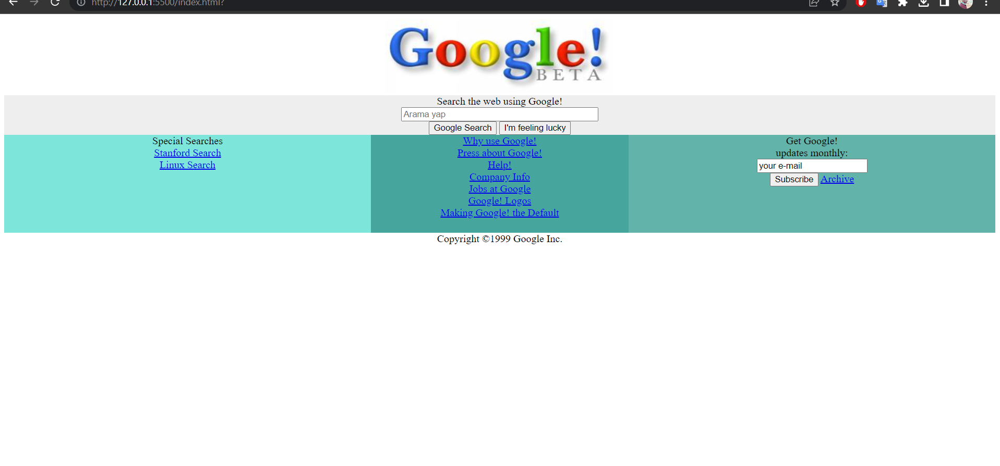

# Google Ana Sayfasını Tasarlamak (1998)
Bu repo [kodluyoruz](https://kodluyoruz.org/) Front-end eğitimde oluşturduğumuz css ödev2 Google Ana Sayfasını Tasarlamak (1998) adı altında yedinci repodur. İçerisinde bir adet README dosyası, bir adet de index.html, bir adet image dosyası, bir adet stle.css dosyası barındırıyor.

## Proje Görünümü

## Hesaplarım
Github [click](https://github.com/cetinyazici) !

LinkedIn [click](https://www.linkedin.com/in/cetinyazici/) !

Patika.dev [click](https://app.patika.dev/yazilimyazici) !